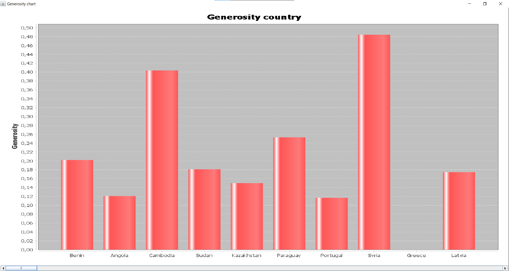
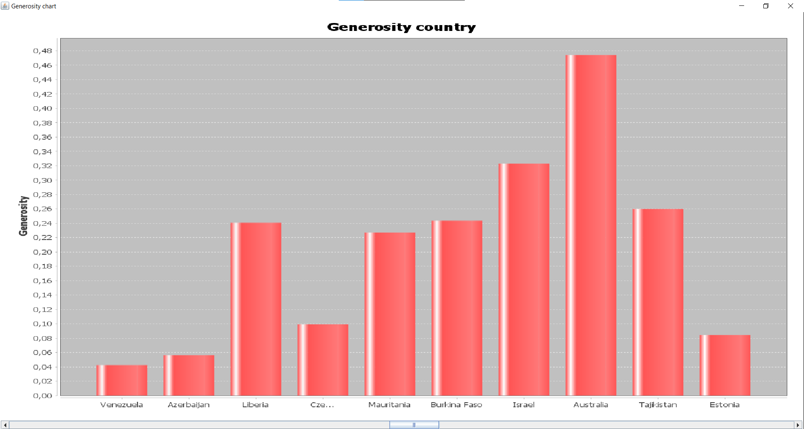
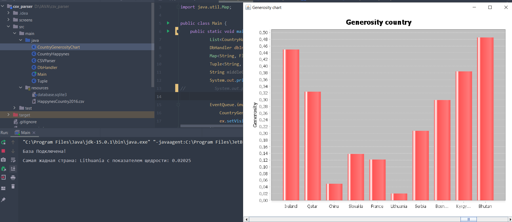
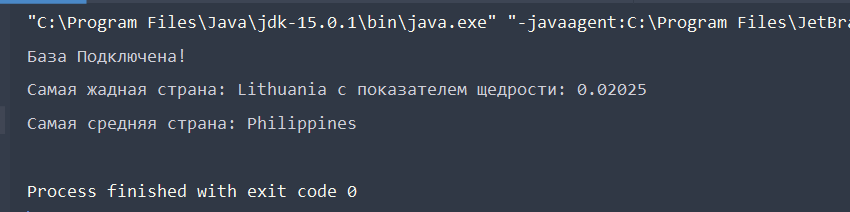

# Итоговый проект JAVA

### Вариант 10 - Показатели стран 2016

#### Процесс работы 
* Написание POJO класса

Структура файла довольно простая, поэтому нет смысла в том, чтобы создавать 
больше одной таблицы, так как это только усложнит доступ к данным и не избавит
от повторяемости данных. Итоговый вид POJO представлен в файле `CountryHappynes.java`
Так как файл содержит довольно большое количество полей(пусть и не критично большое)
было решенно передавать в конструктор словарь.

* Парсинг данных из CSV файла

Класс парсера находится в файле `CSVParser.java` и содержит единственный статический
метод `ParseHappynesCountryCsv(String fileName)` принимающий имя файла. Сам файл находится
в директории ресурсов. 

* Взаимодействие с базой данных

Класс отвечающий за работу с базой данных в файле `DbHandler.java`. Файл базы данных так же
берется из директории ресурсов. Для того, что бы не открывать лишних соединений с базой данных, конструктор
класса вызывается из статического метода `getInstance()`, который либо создат соединение, либо вернет уже существующее.
Таблица в базе данных полностью соответствует CSV, почему так, описано в первом пункте. В этом классе есть методы создания
таблицы и добавления в нее данных(`addCountryList(List<CountryHappynes> country)`, `public void createTable()`)

#### Выпонение зданий
* Задание 1: Сформируйте график по показателю щедрости объеденив их по странам

Так как в таблице более 150 стран, на графике названия этих стран стали не читаемыми, поэтому был вынужден добавить скроллер, решение
не самое идеальное, но как мне кажется рабочее.

* Задание 2: Выведите в консоль страну с самым низким показателем щедрости среди "Middle East and Northern Africa" и "Central and Eastern Europe"

* Задание 3: Найдите страну с "самыми средними показателями" среди "Southeastern Asia" и "Sub-Saharan Africa"

